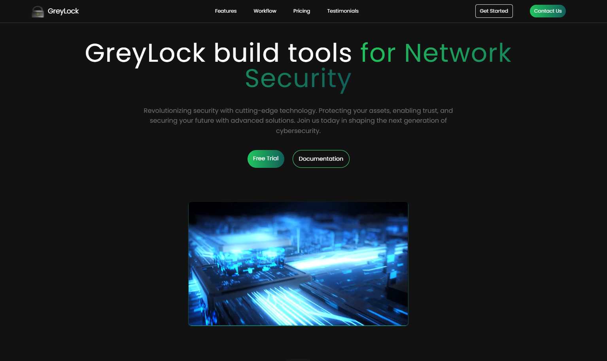

# Greylock Frontend System



Welcome to the **Greylock Security System** Landing page. This project is the frontend component of the Greylock system. Built using modern technologies, the Greylock Frontend System ensures scalability, responsiveness, and intuitive user experiences.

## Landing Page Structure

The landing page of the Greylock Frontend System is designed for optimal user engagement and a clean, modern interface. Below is the structure:

### App.js

```javascript
import { useState } from 'react';
import reactLogo from './assets/react.svg';
import viteLogo from '/vite.svg';
import Navbar from './components/Navbar';
import HeroSection from './components/HeroSection';
import FeatureSection from './components/FeatureSection';
import Workflow from './components/Workflow';
import Pricing from './components/Pricing';
import Testimonials from './components/Testimonials';
import Footer from './components/Footer';
import ContactPage from './components/Contact';

function App() {
  const [count, setCount] = useState(0);

  return (
    <>
      <Navbar />
      <div className='max-w-7xl mx-auto pt-20 px-6'>
        <HeroSection />
        <FeatureSection />
        <Workflow />
        <Pricing />
        <Testimonials />
        <ContactPage />
        <Footer />
      </div>
    </>
  );
}

export default App;
```

### Components

1. **Navbar**
   - Displays the navigation bar with links to different sections.
   - Located at `./components/Navbar`.

2. **HeroSection**
   - Highlights the core value proposition.
   - Located at `./components/HeroSection`.

3. **FeatureSection**
   - Showcases the main features of the system.
   - Located at `./components/FeatureSection`.

4. **Workflow**
   - Describes the workflow of using the Greylock system.
   - Located at `./components/Workflow`.

5. **Pricing**
   - Displays pricing plans and tiers.
   - Located at `./components/Pricing`.

6. **Testimonials**
   - User testimonials and reviews.
   - Located at `./components/Testimonials`.

7. **ContactPage**
   - Contact form for user inquiries.
   - Located at `./components/Contact`.

8. **Footer**
   - Contains copyright and additional links.
   - Located at `./components/Footer`.

### File Structure

```plaintext
src/
├── assets/                # Images and static assets
├── components/            # Reusable components
│   ├── Navbar.js
│   ├── HeroSection.js
│   ├── FeatureSection.js
│   ├── Workflow.js
│   ├── Pricing.js
│   ├── Testimonials.js
│   ├── Footer.js
│   └── Contact.js
├── App.js                 # Main entry point
├── index.js               # React DOM rendering
└── styles/                # CSS and styling files
```

## Getting Started

1. Clone the repository:

   ```bash
   git clone https://github.com/FlxBot001/GreyLock_Sec_Website.git
   cd greylock-frontend
   ```

2. Install dependencies:

   ```bash
   npm install
   ```

3. Run the development server:

   ```bash
   npm run dev
   ```

4. Open [http://localhost:3000](http://localhost:3000) to view the landing page.

## Contribution Guidelines

We welcome contributions! To contribute:

1. Fork the repository.
2. Create a feature branch:

   ```bash
   git checkout -b feature/your-feature-name
   ```

3. Commit your changes:

   ```bash
   git commit -m "Add your message here"
   ```

4. Push the branch:

   ```bash
   git push origin feature/your-feature-name
   ```

5. Open a pull request.

## License

This project is licensed under the [MIT License](LICENSE).

## Contact

For further information or support, please contact:

- **Author:** Felix Nganga
- **Email:** felix.nganga@example.com

---

Thank you for using your collaborations. Your contributions and feedback are greatly appreciated!
